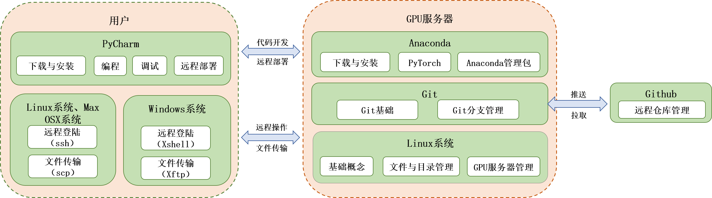

深度学习项目开发新手教程
============================

PDF下载地址：[深度学习项目开发新手教程V2.3.pdf](https://github.com/tanmingkui/development-tutorial-for-beginner/blob/master/%E6%B7%B1%E5%BA%A6%E5%AD%A6%E4%B9%A0%E9%A1%B9%E7%9B%AE%E5%BC%80%E5%8F%91%E6%96%B0%E6%89%8B%E6%95%99%E7%A8%8BV2.3.pdf)

## 框架图

## 目录

* 远程操作Linux服务器
  * Windows系统远程登陆Linux服务器（下载、安装和使用Xshell）
  * Windows系统上传或下载文件（下载、安装和使用Xftp）
  * Linux系统、Mac OSX系统远程登录Linux服务器
  * Linux系统上传或下载文件
* inux系统基本操作
  * Linux基础概念
  * Linux文件与目录管理
  * GPU服务器管理
* Anaconda与PyTorch的下载、安装和使用
  * Anaconda简介
  * Anaconda下载与安装
  * Anaconda管理包
  * PyTorch简介
  * PyTorch下载与安装(Linux系统服务器)
  * PyTorch中文文档
* PyCharm基础教程
  * PyCharm的下载与安装
  * 编写Python程序
  * 进行调试
  * 进行远程部署
  * 进行远程调试
* Git、Github基本操作
  * Git基础
  * Github远程仓库管理
  * Git分支管理

## 更新日志
### v2.3 (2019/07/13)
* 在GPU服务器管理章节中添加磁盘管理指南

### v2.2 (2019/01/08)
* 新增PyCharm远程调试

### v2.1 (2019/01/05)
* 新增框架图

### v2.0 (2019/01/03)
* 优化排版

### v1.0 (2019/01/03)
* 完成初版

## 贡献者

感谢以下参与项目的人：
[@liujingcs](https://github.com/liujingcs)
[@HaoKun-Li](https://github.com/HaoKun-Li)
[@tanmingkui](https://github.com/tanmingkui)

## 如何贡献

非常欢迎你的加入! [提一个Issue](https://github.com/tanmingkui/development-tutorial-for-beginner/issues/new) 或者提交一个 Pull R equest.

## 使用许可

[MIT](LICENSE) © Richard Littauer